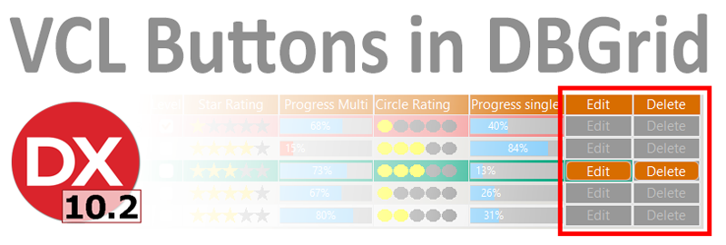

There has been a trend for cloud based applications to show the Delete and Edit
buttons in the grid. So a quick search on the net revealed that very little
information on how to create a Styled Working Button in a Standard VCL DBGrid.
So here is a development prototype that could be implemented in your
application.

How should this Styled Button appear and function in the DBGrid:-

-   Must be visible but inactive in state on all non- focused rows of the
    DBGrid.

-   Also focused when the row is focused.

-   Become a fully functional standard button i.e. makes uses all button events.

-   Be able to reflect the style of the Application and update to any live style
    change.

Take a look at how the buttons are seamlessly integrated in the DBGrid below.
Then read on how to quickly implement this in to your DBGrid.

Continue reading the blog to get the full story on this…

https://bayeseanblog/................

Happy Coding

Greg
